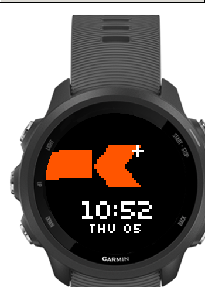

# Kite Watch Face

An animated Zerodha Kite watchface for Garmin's wearable lineup.



## Features

- Animates whenever you look at your watch.
- Includes Date, Battery Low indicator.
- When Bluetooth drops, the trail turns grey.

## Build from Source

Requires [Docker](https://docs.docker.com/get-docker/) or [Podman](https://podman.io/).

```bash
# Build for a specific device (default: fr245)
./build.sh fr245

# Other devices
./build.sh fr245m
./build.sh fenix5
```

Output: `build/kite-<device>.prg`

## Install

1. Connect your Garmin watch via USB.
2. Mount it as a USB drive.
3. Copy the `.prg` file:
   ```bash
   cp build/kite-fr245.prg /path/to/GARMIN/GARMIN/Apps/
   ```
4. Safely eject the watch.
5. On the watch, go to **Settings → Watch Face** and select **Kite**.
